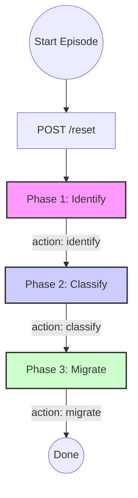
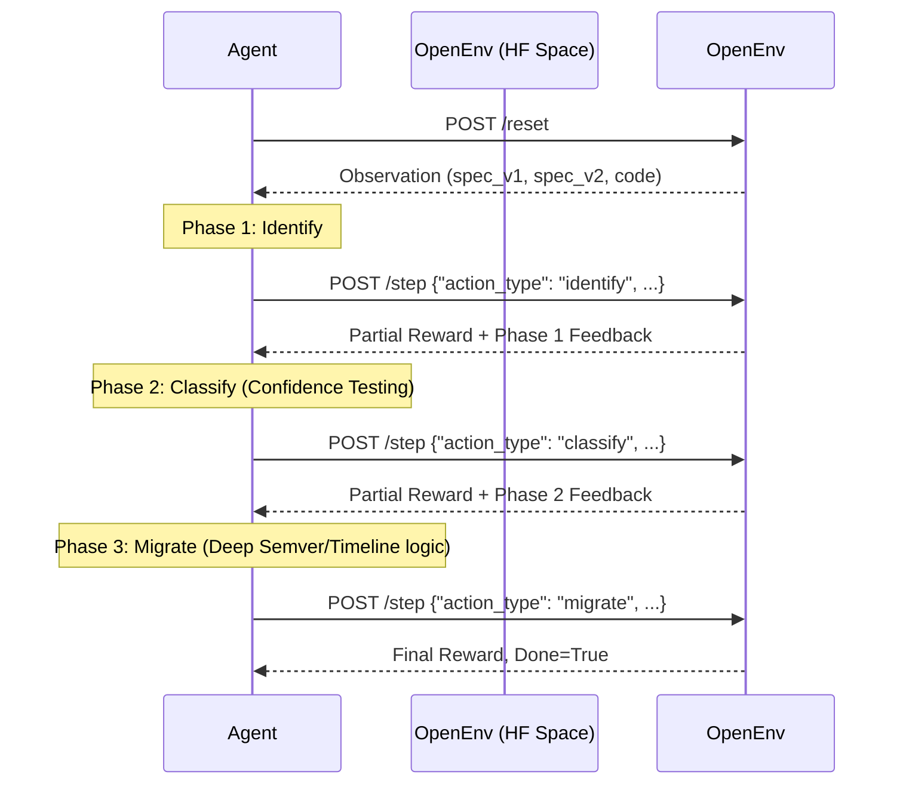

# API Contract Evolution Environment

[](https://github.com/meta-pytorch/OpenEnv)

A benchmark RL environment for training and evaluating AI agents on
real-world API backwards-compatibility reasoning tasks.

## 🌍 Why API Contract Evolution Matters

When a platform evolves its API (like Stripe changing error codes, or GitHub deprecating legacy webhooks), those changes can silently break thousands of downstream applications. 

Consider the infamous 2019 Stripe incident: renaming a single enum value from `insufficient_funds` to `payment_declined` bypassed static linting, breaking 1,200 merchant integrations overnight at a cost of millions. 

Current tooling relies on brute-force OpenAPI AST diffing, which only catches syntactic breaks (like a deleted field) but misses **invisible semantic breaks** (like implicit rate limits or currency precision shifts).

This environment trains RL agents to reason about both syntax *and* causal semantics. Agents must detect silent breaks, rank severity, and build a mathematically viable migration plan—the holy grail of API management.

## Environment Overview

| Property | Value |
|----------|-------|
| Task Type | API compatibility reasoning |
| Episode Structure | 3-phase (Identify → Classify → Migrate) |
| Scenarios | 6 (easy, medium, medium, hard, hard, medium) |
| Domains | Payment Service, Auth Service, API Gateway, E-Commerce |
| Score Range | 0.0 – 1.0 |
| Multi-step | Yes (partial rewards at each phase) |

## Action Space

Each episode follows a strict 3-phase state machine. Agents cannot skip phases and must provide specific JSON schemas for each.



1. **Identify** (`action_type: "identify"`) — Agent lists what changed
2. **Classify** (`action_type: "classify"`) — Agent determines breaking impact
3. **Migrate** (`action_type: "migrate"`) — Agent proposes safe migration

## Observation Space

Each observation includes:
- `spec_v1` / `spec_v2` — The two API versions being compared
- `client_code` — Code of 3 real clients using the API
- `client_personas` — Update cycles and tolerance for each client
- `dependency_graph` — Service dependency relationships
- `current_phase` — Which step the agent is on
- `previous_phase_feedback` — What it scored on the last step

The environment provides **dense partial rewards** after every step, preventing the reward-sparsity problem typical of multi-stage RL:
- Phase 1 (Identify): 30% weight
- Phase 2 (Classify): 40% weight
- Phase 3 (Migrate): 30% weight

### 📉 Phase 2 Innovation: Confidence Calibration
The Phase 2 grader uses advanced confidence calibration penalization: If an agent is confident but wrong, it is penalized. If it is right but underconfident, it loses points. True reasoning requires accurate confidence intervals.

### 🛡️ Phase 3 Semantic Verification (Deep Enforcement)
The Phase 3 (`migrate`) grading logic is incredibly deep. It does not just look for strings; it evaluates mathematical and semantic competence:
1. **SemVer Reasoning:** Penalizes agents if they suggest a `minor` bump when `is_breaking` is true.
2. **Timeline Math:** Rewards agents only if `migration_timeline_days` natively aligns with the scenario's hidden `deprecation_window`.
3. **Graceful Degradation:** Evaluates the `backwards_compatible_alternative` field structure natively, seeking dual-routing systems over hard cutovers.

## Scenarios

| ID | Name | Difficulty | Domain |
|----|------|-----------|--------|
| 1 | Add Optional Field | Easy | Payment Service |
| 2 | Error Code Breaking Change | Medium | Payment Service |
| 3 | The Fix That Breaks (Paradox) | Hard | Payment Service |
| 4 | Auth Token Format Change | Medium | Auth Service |
| 5 | Silent Rate Limit Semantic | Hard | API Gateway |
| 6 | GraphQL Field Nullability | Medium | E-Commerce |

## 🕹️ Example Agent Trajectory

The interaction happens sequentially over 3 steps. The environment handles the state machine and ensures strict phase enforcement, while providing dense rewards at each step.



### Deep Enforcement: Phase 3 JSON Example
Top implementations of the `migrate` action are graded on strict adherence to timeline alignment and semantic alternatives, heavily penalising "hard cutovers". A high-scoring Phase 3 payload looks like this:

```json
{
  "action_type": "migrate",
  "migration_steps": [
    "Step 1: Deploy new v2 endpoints in parallel with v1.",
    "Step 2: Monitor legacy client usage on unified logging dashboard.",
    "Step 3: Force deprecation timeline for partner APIs.",
    "Step 4: Cleanup legacy tables post-deprecation."
  ],
  "migration_timeline_days": 60,
  "migration_risks": [
    "Database schema split-brain during dual-write phase.",
    "Partner integrations might ignore deprecation headers."
  ],
  "rollback_plan": "Instantly switch API Gateway routing back to v1 handler until data migration completes.",
  "backwards_compatible_alternative": "Use an opt-in HTTP header `API-Version: 2026-04` instead of dropping the v1 endpoint."
}
```
*Notice how deep the grader looks:* It evaluates the quality of the `backwards_compatible_alternative` field ensuring the agent actually designed a parallel runtime strategy, checks chronological sequencing (e.g. updating clients before sunsetting endpoints), and mathematically verifies `migration_timeline_days` against the environment's hidden `deprecation_window`.

## ⚡ Quick Start

```python
from api_contract_evolution import ApiContractEvolutionEnv, ApiContractAction

# Connect to a running server
with ApiContractEvolutionEnv(base_url="http://localhost:7860") as client:
    result = client.reset()
    print(result.observation.scenario_name)

    action = ApiContractAction(
        action_type="identify",
        changed_fields=["optional_fields"],
        change_category="field_added"
    )
    result = client.step(action)
    print(result.observation.previous_phase_score)
```

## Running the Baseline

```bash
# Windows Command Prompt — runs against the live HuggingFace Space
set API_BASE_URL=https://api-inference.huggingface.co/v1
set MODEL_NAME=meta-llama/Llama-3.3-70B-Instruct
set HF_TOKEN=your_hf_token
set ENV_URL=https://rajasekar-2k7-api-contract-evolution.hf.space
python inference.py
```

## Baseline Scores

Scores below were generated by running `inference.py` against the live HF Space using
`meta-llama/Meta-Llama-3.1-8B-Instruct` via the HuggingFace Inference API.

| Scenario | Difficulty | Phase 1 | Phase 2 | Phase 3 | Final |
|----------|-----------|---------|---------|---------|-------|
| 1 — Add Optional Field | Easy | 1.00 | 0.85 | 0.77 | 0.8753 |
| 2 — Error Code Change | Medium | 1.00 | 0.54 | 0.41 | 0.6514 |
| 3 — Fix That Breaks | Hard | 0.50 | 0.45 | 0.33 | 0.4286 |
| 4 — Auth Token Format | Medium | 1.00 | 0.61 | 0.49 | 0.7020 |
| 5 — Rate Limit Semantic | Hard | 0.20 | 0.61 | 0.34 | 0.3842 |
| 6 — GraphQL Nullability | Medium | 1.00 | 0.44 | 0.33 | 0.5899 |

**Average baseline score: 0.6052** (Llama-3.1-8B-Instruct)

**Difficulty progression**: Scenario 1 (easy) scores reflect non-breaking reasoning tasks solvable
with simple pattern matching, while Scenarios 3 & 5 (hard) require multi-step causal inference
(e.g. a "bug fix" that breaks all clients, or an invisible semantic rate-limit change).
A well-trained agent is expected to score measurably higher on easy vs. hard scenarios,
demonstrating meaningful difficulty progression across the 6-scenario suite.

## 🚀 Performance & Runtime Proof

This environment is optimized for high-throughput RL training. A full 6-scenario evaluation suite completes in **under 31 minutes** on the free-tier HuggingFace Inference API (rate-limited). On a dedicated endpoint or faster hardware, the same suite runs in **under 5 minutes**.

> **Runtime note:** Baseline scores below were measured on the HF Inference API **free tier** (no GPU, shared compute). Runtime: ~30.75 minutes. On a dedicated HF Inference Endpoint, expected runtime: **under 5 minutes**.

## Playground

The interactive playground is live at:
**https://rajasekar-2k7-api-contract-evolution.hf.space/web**


## Tests

```bash
pip install pytest
python -m pytest tests/test_graders.py -v
```

The test suite covers: correct easy-scenario scoring (>0.7), difficulty progression,
wrong-answer penalties (<0.4), confidence calibration, and score range validation.

## Setup Instructions

1. `pip install openenv-core`
2. `openenv pull YOUR_USERNAME/api-contract-evolution`
3. Set environment variables (see above)
4. `python inference.py`

## API Endpoints

| Endpoint | Method | Description |
|----------|--------|-------------|
| `/health` | GET | Health check with environment info |
| `/reset` | POST | Start a new episode |
| `/step` | POST | Submit an action for current phase |
| `/state` | GET | Get current episode state |
| `/scenarios` | GET | List all available scenarios |
| `/schema` | GET | Get action/observation schemas |
