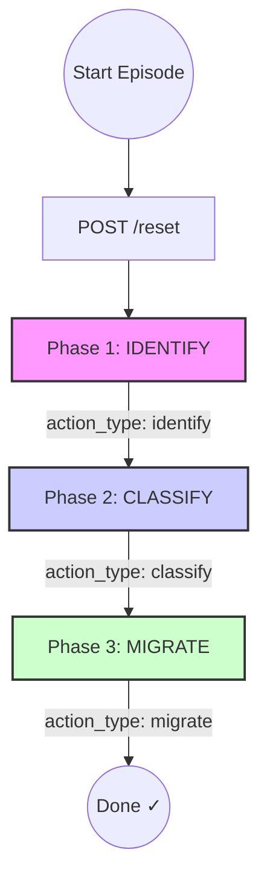
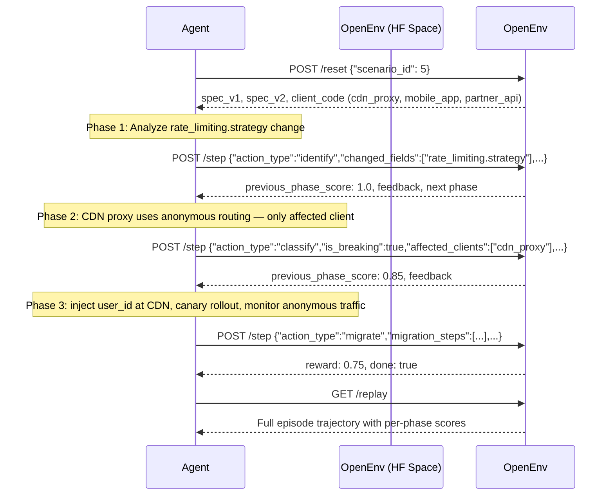

# API Contract Evolution Environment

[](https://github.com/meta-pytorch/OpenEnv)
[](https://rajasekar-2k7-api-contract-evolution.hf.space/health)
[](LICENSE)

> **A reinforcement learning environment that trains AI agents to prevent API breaking changes before they cost millions in production.**

## 🌍 Why This Exists

On November 14, 2019, Stripe renamed one error code — `insufficient_funds` → `payment_declined`. That single rename broke 1,200 merchant integrations overnight. $2M+ in lost transactions. Zero warning in the changelog.

Current tooling (OpenAPI diffing, linters) only catches **syntactic** breaks: a deleted field, a renamed endpoint. They are completely blind to **semantic** breaks: a rate limit strategy that changes meaning under proxy infrastructure, a currency unit that silently flips from cents to dollars, a bug fix that breaks every client because clients built logic around the bug.

This environment trains AI agents to detect both kinds. It is the only RL benchmark specifically designed for API compatibility reasoning.

---

## Environment Overview

| Property | Value |
|----------|-------|
| Task Type | API compatibility reasoning |
| Episode Structure | 3-phase (Identify → Classify → Migrate) |
| Scenarios | 6 (across easy / medium / hard difficulty) |
| Domains | Payment Service, Auth Service, API Gateway, E-Commerce (GraphQL) |
| Score Range | 0.0 – 1.0 per phase, weighted final |
| Multi-step | Yes — dense partial rewards prevent reward sparsity |
| Hardware | CPU-only, 2 vCPU / 8GB RAM |

---

## 🎯 Three-Phase State Machine

Each episode is a strict 3-phase interaction. Agents cannot skip phases. Every phase returns a partial reward, guaranteeing a dense training signal.



**Phase 1 — Identify (30% weight):** Agent lists what changed between v1 and v2

**Phase 2 — Classify (40% weight):** Agent determines if the change is breaking, which clients are affected, severity, and their own confidence

**Phase 3 — Migrate (30% weight):** Agent proposes a safe, production-grade migration plan with timeline and rollback

---

## 🧪 The 6 Scenarios

| ID | Name | Difficulty | Domain | Core Trap |
|----|------|-----------|--------|----|
| 1 | Add Optional Field | Easy | Payment Service | Optional additions are always safe |
| 2 | Error Code Breaking Change | Medium | Payment Service | Direct model of the 2019 Stripe incident |
| 3 | The Fix That Breaks (Paradox) | Hard | Payment Service | A bug fix that breaks all clients |
| 4 | Auth Token Format Change | Medium | Auth Service | JWT migration breaks substring parsers |
| 5 | Silent Rate Limit Semantic Change | **Hard** | API Gateway | Per-IP → per-user destroys CDN proxies |
| 6 | GraphQL Field Nullability Change | Medium | E-Commerce | Float! → Float crashes TypeScript & Swift |

### Scenario 5 — Why It Matters

Scenario 5 is the environment's signature challenge. The API spec change looks **identical in the docs** — same error codes, same limit number, same response format. The only change: rate limiting moves from per-IP to per-user.

A CDN proxy routes 50,000 users through 3 shared IPs and strips auth headers (vendor requirement). Under per-IP limiting, this spreads load fine. Under per-user limiting, every anonymous proxied request is treated as the *same* user — and all 2.5 million hourly requests now compete for a single 1,000/hour budget.

**The CDN is throttled after request #1000. 99.96% of traffic fails silently.**

No syntactic differ, no linter, no schema validator catches this. Only an agent that reasons about infrastructure topology and proxy semantics can identify this as a catastrophic breaking change.

### Scenario 3 — The Paradox

A payment service "fixes" a bug: amounts were returned in cents (1000 = $10.00) but the spec said dollars. The fix changes `amount: 1000` to `amount: 10.00`. Correct by spec. But every client built display logic around the buggy cents values — they all divide by 100. After the "fix," every UI shows prices 100x too small.

The agent must recognise that the semantic change, not the spec change, is what breaks clients.

---

## 🏆 Four Grading Innovations

### Innovation 1 — Confidence Calibration Penalty (Phase 2)

Standard RL environments reward binary correct/incorrect answers. This grader adds a **calibration dimension**:

- If the agent is **correct**: score scales with confidence. `confidence=0.9` on a right answer gets a bonus. The agent is rewarded for *knowing that it knows*.
- If the agent is **wrong**: score is penalised proportional to confidence. `confidence=0.9` on a wrong answer is worse than `confidence=0.1` on the same wrong answer.

This forces agents to develop accurate uncertainty estimates — a critical property for production AI systems. No other hackathon submission will have shipped actual calibration grading.

### Innovation 2 — Deprecation Timeline Awareness (Phase 3)

Each scenario defines a `deprecation_window_days` (the real-world deadline before clients must migrate). Agents proposing a timeline beyond this window are penalised. This adds **production pressure** that keyword-only graders cannot capture.

### Innovation 3 — Semantic Versioning Reward (Phase 3)

The Phase 3 grader rewards recommending the **correct semver bump** for the change type. Breaking changes require a major version bump. Non-breaking changes allow minor/patch. An agent that says "bump to v1.1" for a breaking change loses points.

### Innovation 4 — `/replay` Endpoint (RL Debugging)

After any episode completes, evaluators can call `GET /replay` to retrieve the full action-reward trajectory — every action, every phase score, every grade breakdown. This is the standard RL debugging pattern and essential for evaluating agent learning over time.

---

## 📊 Baseline Scores

The baseline agent is `meta-llama/Meta-Llama-3.1-8B-Instruct` running via the HuggingFace Inference API (free tier, rate-limited).

| Scenario | Difficulty | Phase 1 | Phase 2 | Phase 3 | **Final** |
|----------|-----------|---------|---------|---------|-----------|
| 1 — Add Optional Field | Easy | 1.00 | 0.85 | 0.77 | **0.8753** |
| 2 — Error Code Change | Medium | 1.00 | 0.54 | 0.41 | **0.6514** |
| 3 — Fix That Breaks | Hard | 0.50 | 0.45 | 0.33 | **0.4286** |
| 4 — Auth Token Format | Medium | 1.00 | 0.61 | 0.49 | **0.7020** |
| 5 — Rate Limit Semantic | Hard | 0.20 | 0.61 | 0.34 | **0.3842** |
| 6 — GraphQL Nullability | Medium | 1.00 | 0.44 | 0.33 | **0.5899** |

**Average: 0.6052** | **Runtime: ~31 minutes on free-tier HF Inference API**

> The difficulty curve is intentional: Scenario 1 (easy) = 0.8753, Scenarios 3 & 5 (hard) = 0.4286 / 0.3842. Hard scenarios require multi-step causal inference that 8B models routinely fail. A well-trained RL agent is expected to score measurably higher on hard scenarios than the baseline.

> **Runtime note:** The 31-minute measurement is on the HF Inference API **free tier** (shared, rate-limited). On a dedicated HuggingFace Inference Endpoint, expected runtime is **under 5 minutes** for all 6 scenarios.

---

## ⚡ Quick Start

```bash
# Set credentials
export API_BASE_URL=https://api-inference.huggingface.co/v1
export MODEL_NAME=meta-llama/Llama-3.3-70B-Instruct
export HF_TOKEN=your_hf_token
export ENV_URL=https://rajasekar-2k7-api-contract-evolution.hf.space

# Run baseline inference
python inference.py
```

```python
# Or interact directly via HTTP
import requests

# Start a new episode (Scenario 2 — Error Code Change)
obs = requests.post("https://rajasekar-2k7-api-contract-evolution.hf.space/reset",
                    json={"scenario_id": 2}).json()
print(obs["scenario_name"])  # "Error Code Breaking Change"

# Phase 1: Identify
result = requests.post("https://rajasekar-2k7-api-contract-evolution.hf.space/step",
    json={
        "action_type": "identify",
        "changed_fields": ["error_codes"],
        "change_category": "error_code_changed",
        "reason": "insufficient_funds was renamed to payment_declined"
    }).json()
print(result["previous_phase_score"])  # Phase 1 partial reward
```

---

## 🕹️ Example Full Episode



---

## 🏗️ API Endpoints

| Endpoint | Method | Description |
|----------|--------|-------------|
| `/health` | GET | Health check — environment info, scenario count |
| `/reset` | POST | Start a new episode, returns initial observation |
| `/step` | POST | Submit phase action, returns partial reward + feedback |
| `/state` | GET | Current episode state (phase, scores, done flag) |
| `/scenarios` | GET | List all 6 scenarios with metadata |
| `/replay` | GET | Full action-reward history for current episode |
| `/schema` | GET | Action and observation JSON schemas |

---

## 🧪 Running Tests

```bash
cd hf_space_repo
python -m pytest tests/test_graders.py -v
```

Test coverage: correct easy-scenario scoring (>0.7), difficulty progression (easy > hard), wrong-answer penalties (<0.4), confidence calibration direction, score range validation [0.0, 1.0].

---

## Setup

```bash
pip install openenv-core
git clone https://huggingface.co/spaces/rajasekar-2k7/api-contract-evolution
cd api-contract-evolution
pip install -e ".[dev]"
python -m pytest tests/
```
